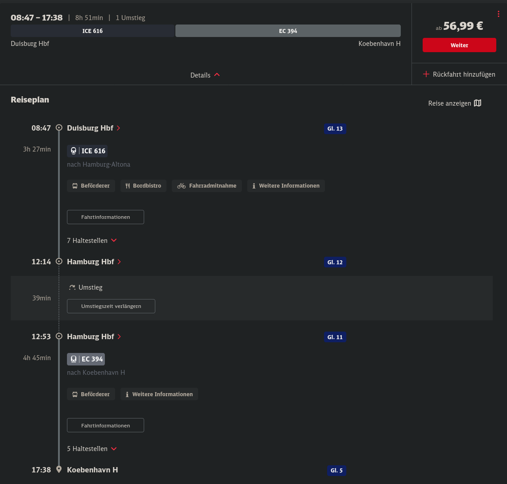
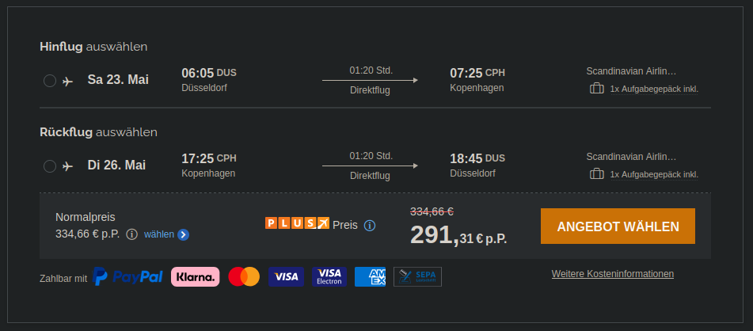
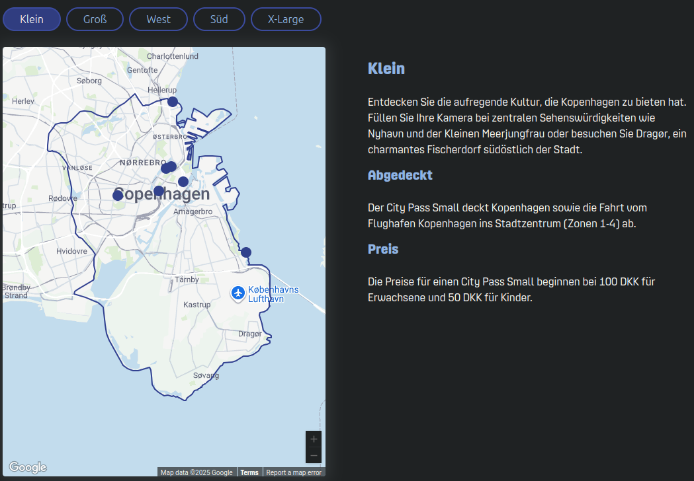

# Kopenhagen

## Termine

* 14.05.2026 (Do) Christi Himmelfahrt
* 25.05.2026 (Mo) Pfingsten
* 04.06.2026 (Mo) Frohnleichnahm

## Anreise

### ICE

Fahrten für 2026 sind Stand jetzt (30.08.2025) auf [bahn.de](https://www.bahn.de) noch nicht abrufbar.

Eine einfache Fahrt für eine Person an einem Donnerstag (11. Dez. 2025) von *Duisburg Hbf* nach *Kopenhagen Hbf* ist in Abb. 1 zu sehen.

Abb 1: Kosten Kopenhagen ICE+EC

### Flug

Ausgewählt werden Hin- & Rückflug für eine Person von Düsseldorf nach Kopenhagen als Direktflüge inkl. Freigepäck auf der Seite [fluege.de](https://www.fluege.de). Außerdem wurde nicht der preiswerteste gewählt, sondern ein Flug, der eine entspannte Abreise am letzten Tag ermöglicht.

#### Christi Himmelfahrt (14.05 - 17.05.2026)

Optional eine Anreise am Abend vorher.

#### Pfingsten (23.05 - 26.05.2026)

Optional eine Anreise am Abend vorher.

#### Frohnleichnahm (04.06 - 07.06.2026)

Optional eine Anreise am Abend vorher.

### Unterkunft

Ausgewählt werden Unterkünfte in Kopenhagen ohne Schlafsaal auf [booking.com](https://www.booking.com).

Notierte Orte als [Maps](https://www.google.com/maps/d/edit?mid=1IQ-LfIrXaFurYMmDMT81Bwq7JfBF6n8&ll=55.67789131069193%2C12.569107132083252&z=12) gespeichert.

#### Christi Himmelfahrt (14.05 - 17.05.2026)

| Name | Preis | Ausstattung | Adresse |
|---|---|---|---|
| [Cozy Copenhagen Getaway](https://www.booking.com/hotel/dk/cozy-copenhagen-getaway-kobenhavn.en-gb.html?aid=304142&label=gen173nr-10CAEoggI46AdIM1gEaDuIAQGYATO4ARnIAQ_YAQPoAQH4AQGIAgGoAgG4Avvhy8UGwAIB0gIkOTY5NWY1YmYtYWE5Ni00N2RkLWI4M2MtOWI4MDlmYTZkNDQz2AIB4AIB&sid=6f4c4377b6d7b13e6178aa699d11e583&age=11&all_sr_blocks=1356409801_407941543_5_0_0&checkin=2026-05-14&checkout=2026-05-17&dest_id=-2745636&dest_type=city&dist=0&group_adults=4&group_children=1&hapos=1&highlighted_blocks=1356409801_407941543_5_0_0&hpos=1&matching_block_id=1356409801_407941543_5_0_0&no_rooms=3&req_adults=4&req_age=11&req_children=1&room1=A%2C11&room2=A&room3=A%2CA&sb_price_type=total&sr_order=price&sr_pri_blocks=1356409801_407941543_5_0_0__310500&srepoch=1756557725&srpvid=9201590cea760106&type=total&ucfs=1) | €416 | Apartment, 1 Doppelbett, 1 Einzelbett, 1 Schlafsofa | Kirkebjerg Allé 47 st th, 2720 Copenhagen, Denmark |
| [Unique location](https://www.booking.com/hotel/dk/unique-location.en-gb.html?label=gen173nr-10CAEoggI46AdIM1gEaDuIAQGYATO4ARnIAQ_YAQPoAQH4AQGIAgGoAgG4Avvhy8UGwAIB0gIkOTY5NWY1YmYtYWE5Ni00N2RkLWI4M2MtOWI4MDlmYTZkNDQz2AIB4AIB&sid=6f4c4377b6d7b13e6178aa699d11e583&aid=304142&ucfs=1&arphpl=1&checkin=2026-05-14&checkout=2026-05-17&dest_id=-2745636&dest_type=city&group_adults=4&req_adults=4&no_rooms=3&group_children=1&req_children=1&age=11&req_age=11&hpos=2&hapos=2&sr_order=price&srpvid=9201590cea760106&srepoch=1756557914&all_sr_blocks=1472015001_418542727_5_0_0&highlighted_blocks=1472015001_418542727_5_0_0&matching_block_id=1472015001_418542727_5_0_0&sr_pri_blocks=1472015001_418542727_5_0_0__366390&from=searchresults) | €491 | Apartment, 1 Doppelbett, 1 Einzelbett (Empfohlen für 5 Personen, aber nicht genug Betten ausgewiesen.) | Ærøvej 1, 1 sal, 2000 Frederiksberg, Denmark |
| [Bright apt - In heart of Amager](https://www.booking.com/hotel/dk/unique-location.en-gb.html?label=gen173nr-10CAEoggI46AdIM1gEaDuIAQGYATO4ARnIAQ_YAQPoAQH4AQGIAgGoAgG4Avvhy8UGwAIB0gIkOTY5NWY1YmYtYWE5Ni00N2RkLWI4M2MtOWI4MDlmYTZkNDQz2AIB4AIB&sid=6f4c4377b6d7b13e6178aa699d11e583&aid=304142&ucfs=1&arphpl=1&checkin=2026-05-14&checkout=2026-05-17&dest_id=-2745636&dest_type=city&group_adults=4&req_adults=4&no_rooms=3&group_children=1&req_children=1&age=11&req_age=11&hpos=2&hapos=2&sr_order=price&srpvid=9201590cea760106&srepoch=1756557914&all_sr_blocks=1472015001_418542727_5_0_0&highlighted_blocks=1472015001_418542727_5_0_0&matching_block_id=1472015001_418542727_5_0_0&sr_pri_blocks=1472015001_418542727_5_0_0__366390&from=searchresults) | €775 | 2 Schlafzimmer mit Doppelbetten, 1 Sofabett | Amagerbrogade 190, Amager Øst, 2300 Copenhagen, Denmark |
| [Airport getaway](https://www.booking.com/hotel/dk/airport-getaway.en-gb.html?label=gen173nr-10CAEoggI46AdIM1gEaDuIAQGYATO4ARnIAQ_YAQPoAQH4AQGIAgGoAgG4Avvhy8UGwAIB0gIkOTY5NWY1YmYtYWE5Ni00N2RkLWI4M2MtOWI4MDlmYTZkNDQz2AIB4AIB&sid=6f4c4377b6d7b13e6178aa699d11e583&aid=304142&ucfs=1&arphpl=1&checkin=2026-05-14&checkout=2026-05-17&dest_id=-2745636&dest_type=city&group_adults=4&req_adults=4&no_rooms=3&group_children=1&req_children=1&age=11&req_age=11&hpos=12&hapos=12&sr_order=price&srpvid=9201590cea760106&srepoch=1756557978&all_sr_blocks=1472601102_418601938_6_0_0&highlighted_blocks=1472601102_418601938_6_0_0&matching_block_id=1472601102_418601938_6_0_0&sr_pri_blocks=1472601102_418601938_6_0_0__600000&from=searchresults) | €804 | 2 Schlafzimmer mit Doppelbetten, 1 Sofabett | Stenrosevej, Amager Vest, 2300 Copenhagen, Denmark |
| [Delicius apartment near the Beach,Metro, Airport](https://www.booking.com/hotel/dk/delicius-apartment-near-the-beach-metro-airport.en-gb.html?label=gen173nr-10CAEoggI46AdIM1gEaDuIAQGYATO4ARnIAQ_YAQPoAQH4AQGIAgGoAgG4Avvhy8UGwAIB0gIkOTY5NWY1YmYtYWE5Ni00N2RkLWI4M2MtOWI4MDlmYTZkNDQz2AIB4AIB&sid=6f4c4377b6d7b13e6178aa699d11e583&aid=304142&ucfs=1&arphpl=1&checkin=2026-05-14&checkout=2026-05-17&dest_id=-2745636&dest_type=city&group_adults=4&req_adults=4&no_rooms=3&group_children=1&req_children=1&age=11&req_age=11&hpos=14&hapos=14&sr_order=price&srpvid=9201590cea760106&srepoch=1756557998&all_sr_blocks=931908601_414478492_0_0_0&highlighted_blocks=931908601_414478492_0_0_0&matching_block_id=931908601_414478492_0_0_0&sr_pri_blocks=931908601_414478492_0_0_0__591873&from=searchresults) | €793 | 2 Schlafzimmer mit Doppelbett, 1 Schlafzimmer mit 2 Einzelbetten, 1 Sofabett | 105A Tovelillevej 05, Amager Øst, 2300 Copenhagen, Denmark |

#### Pfingsten (23.05 - 26.05.2026)

| Name | Preis | Ausstattung | Adresse |
|---|---|---|---|
| [Cozy Copenhagen Getaway](https://www.booking.com/hotel/dk/cozy-copenhagen-getaway-kobenhavn.en-gb.html?label=gen173nr-10CAEoggI46AdIM1gEaDuIAQGYATO4ARnIAQ_YAQPoAQH4AQGIAgGoAgG4Avvhy8UGwAIB0gIkOTY5NWY1YmYtYWE5Ni00N2RkLWI4M2MtOWI4MDlmYTZkNDQz2AIB4AIB&sid=6f4c4377b6d7b13e6178aa699d11e583&aid=304142&ucfs=1&arphpl=1&checkin=2026-05-23&checkout=2026-05-26&dest_id=-2745636&dest_type=city&group_adults=4&req_adults=4&no_rooms=3&group_children=1&req_children=1&age=11&req_age=11&hpos=1&hapos=1&sr_order=price&srpvid=4f705a01d4f80182&srepoch=1756558248&all_sr_blocks=1356409801_407941543_5_0_0&highlighted_blocks=1356409801_407941543_5_0_0&matching_block_id=1356409801_407941543_5_0_0&sr_pri_blocks=1356409801_407941543_5_0_0__310500&from=searchresults) | €416 | Apartment, 1 Doppelbett, 1 Einzelbett, 1 Schlafsofa | Kirkebjerg Allé 47 st th, 2720 Copenhagen, Denmark |
| [Unique location](https://www.booking.com/hotel/dk/unique-location.en-gb.html) | €593 | Apartment, 1 Doppelbett, 1 Einzelbett (Empfohlen für 5 Personen, aber nicht genug Betten ausgewiesen.) | Ærøvej 1, 1 sal, 2000 Frederiksberg, Denmark |

Nächst günstigste Option bei etwa €1000.

#### Frohnleichnahm (04.06 - 07.06.2026)

Selbst Optionen mit Schalfsälen ab €700.

<iframe src="https://www.google.com/maps/d/embed?mid=1IQ-LfIrXaFurYMmDMT81Bwq7JfBF6n8&ehbc=2E312F" width="640" height="480"></iframe>

## Transport

### City Pass Klein

48h €21.44

[City Pass Klein](https://www.publictransport.dk/de/tickets/city-passde)

### Copenhagen Card

[Copenhagen Card](https://copenhagencard.com/view/card-info)

[Hop (Copenhagen Center)](https://copenhagencard.com/view/hop-transport)

