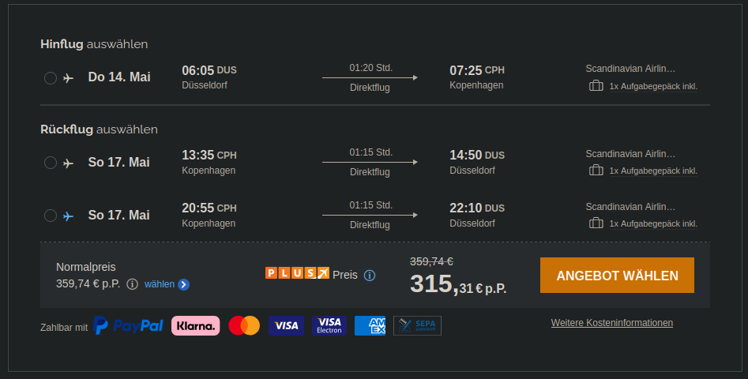
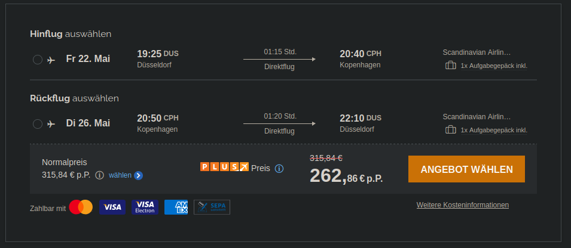

# Kopenhagen

## Termine

* 14.05.2026 (Do) Christi Himmelfahrt
* 25.05.2026 (Mo) Pfingsten
* 04.06.2026 (Mo) Frohnleichnahm

## Anreise

### ICE

Fahrten für 2026 sind Stand jetzt (30.08.2025) auf [bahn.de](https://www.bahn.de) noch nicht abrufbar.

Eine einfache Fahrt für eine Person an einem Donnerstag (11. Dez. 2025) von *Duisburg Hbf* nach *Kopenhagen Hbf* ist in Abb. 1 zu sehen.

Abb 1: Kosten Kopenhagen ICE+EC

### Flug

Ausgewählt werden Hin- & Rückflug für eine Person von Düsseldorf nach Kopenhagen als Direktflüge inkl. Freigepäck auf der Seite [fluege.de](https://www.fluege.de). Außerdem wurde nicht der preiswerteste gewählt, sondern ein Flug, der eine entspannte Abreise am letzten Tag ermöglicht.

#### Christi Himmelfahrt (14.05 - 17.05.2026)

Optional eine Anreise am Abend vorher.

#### Pfingsten (23.05 - 26.05.2026)

Optional eine Anreise am Abend vorher.

#### Frohnleichnahm (04.06 - 07.06.2026)

Optional eine Anreise am Abend vorher.

### Unterkunft

Ausgewählt werden Unterkünfte in Kopenhagen ohne Schlafsaal auf [booking.com](https://www.booking.com).

Notierte Orte als [Maps](https://www.google.com/maps/d/edit?mid=1IQ-LfIrXaFurYMmDMT81Bwq7JfBF6n8&ll=55.67789131069193%2C12.569107132083252&z=12) gespeichert.

#### Christi Himmelfahrt (14.05 - 17.05.2026)

| Name | Preis | Ausstattung | Adresse |
|---|---|---|---|
| [Bright apt - In heart of Amager](https://www.booking.com/hotel/dk/bright-apt-in-heart-of-amager.en-gb.html) | €775 | 2 Schlafzimmer mit Doppelbetten, 1 Sofabett | Amagerbrogade 190, Amager Øst, 2300 Copenhagen, Denmark |
| [Airport getaway](https://www.booking.com/hotel/dk/airport-getaway.en-gb.html) | €804 | 2 Schlafzimmer mit Doppelbetten, 1 Sofabett | Stenrosevej, Amager Vest, 2300 Copenhagen, Denmark |
| [Delicius apartment near the Beach,Metro, Airport](https://www.booking.com/hotel/dk/delicius-apartment-near-the-beach-metro-airport.en-gb.html) | €793 | 2 Schlafzimmer mit Doppelbett, 1 Schlafzimmer mit 2 Einzelbetten, 1 Sofabett | 105A Tovelillevej 05, Amager Øst, 2300 Copenhagen, Denmark |

#### Pfingsten (23.05 - 26.05.2026)

| Name | Preis | Ausstattung | Adresse |
|---|---|---|---|
| [Unique location](https://www.booking.com/hotel/dk/unique-location.en-gb.html) | €593 | Apartment, 1 Doppelbett, 1 Einzelbett (Empfohlen für 5 Personen, aber nicht genug Betten ausgewiesen.) | Ærøvej 1, 1 sal, 2000 Frederiksberg, Denmark |

Nächst günstigste Option bei etwa €1000.

#### Frohnleichnahm (04.06 - 07.06.2026)

Selbst Optionen mit Schalfsälen ab €700.
